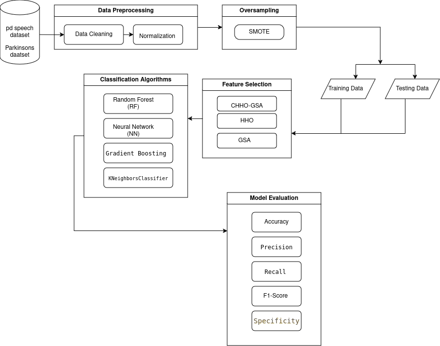
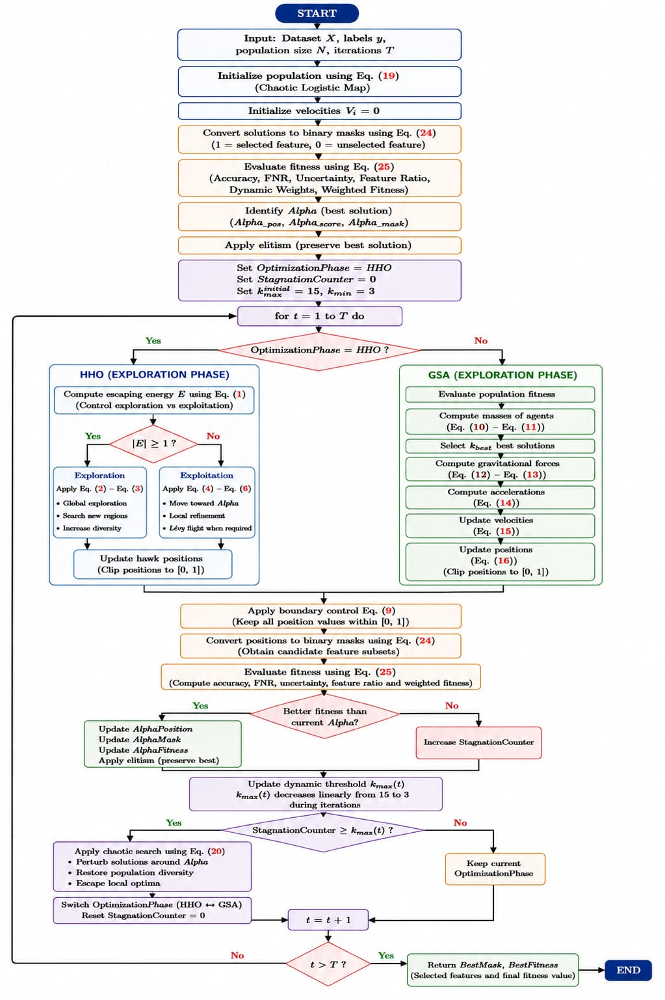
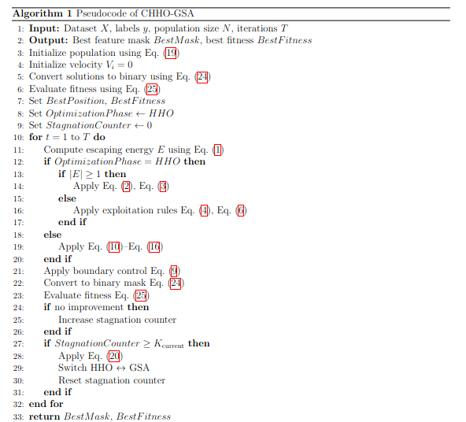

<p align="center">
  
</p>

<h1 align="center">CHHO-GSA for Voice-Based Parkinson’s Disease Detection</h1>

<p align="center">
<b>A Chaotic Harris Hawks–Gravitational Search Hybrid Feature Selection Framework</b>
</p>

<p align="center">
  
  
  
  
</p>

---

## 📘 Introduction

Parkinson’s Disease (PD) is a progressive neurological disorder that affects speech, motor function, and overall quality of life. Early diagnosis plays a critical role in improving treatment outcomes; however, traditional clinical diagnosis is often time-consuming and subjective.

This project introduces **CHHO-GSA**, a hybrid feature selection framework designed for voice-based Parkinson’s Disease detection using machine learning techniques. The proposed method combines:

- **Harris Hawks Optimization (HHO)** for effective global exploration
- **Gravitational Search Algorithm (GSA)** for refined local exploitation
- **Logistic Chaotic Mapping** to improve convergence stability and avoid local optima

The selected optimal features are evaluated using multiple machine learning classifiers, including:

- Random Forest
- Gradient Boosting
- Neural Network
- K-Nearest Neighbors (KNN)

The framework aims to improve classification performance while reducing feature dimensionality, computational complexity, and runtime.

---

## ✨ Key Features

- Hybrid HHO-GSA feature selection algorithm
- Logistic chaotic search mechanism
- High-dimensional feature reduction
- Improved exploration and exploitation balance
- Reduced overfitting risk
- Low computational runtime
- Multiple machine learning classifiers
- Robust evaluation using standard performance metrics


---

## 🧠 Proposed Framework




## 🚀 Installation

### Clone Repository

```bash
git clone https://github.com/Shymaa2611/CHHO-GSA-for-Voice-Based-Parkinson-s-Disease-Detection.git
cd CHHO-GSA-for-Voice-Based-Parkinson-s-Disease-Detection.git
```

### Create Virtual Environment

```bash
python -m venv venv

# Linux / MacOS
source venv/bin/activate

# Windows
venv\Scripts\activate
```

### Install Dependencies

```bash
pip install -r requirements.txt
```

---


## ⚙️ Methodology

### 1️⃣ Data Preprocessing

- Missing value handling
- Feature normalization
- Train-test splitting
- Dataset balancing

### 2️⃣ Feature Selection Using CHHO-GSA

The proposed optimizer combines:

- **HHO** for global exploration
- **GSA** for local exploitation
- **Logistic Chaos** for enhanced diversity and convergence stability



---




### 3️⃣ Machine Learning Classification

The selected feature subsets are evaluated using:

- Random Forest
- Gradient Boosting
- Neural Network
- KNN

### 4️⃣ Performance Evaluation

Evaluation metrics include:

- Accuracy
- Precision
- Recall
- F1-Score
- ROC-AUC
- Confusion Matrix
- Generalization Gap
- Specificity
---

## 📊 Experimental Results

The proposed CHHO-GSA framework achieved:

- Significant feature reduction
- Improved classification accuracy
- Better generalization capability
- Reduced overfitting
- Stable convergence behavior
- Low computational complexity and runtime

Among all classifiers, **Random Forest** and **Gradient Boosting** demonstrated particularly strong and stable performance.

---

## ✅ Advantages

- Effective exploration–exploitation balance
- Reduced dimensionality
- Improved optimization stability
- Low computational runtime
- Better classifier generalization
- Suitable for high-dimensional biomedical datasets

---

## ⚠️ Limitations

- Sensitive to parameter tuning
- Depends on handcrafted acoustic features
- Limited to voice-based datasets
- Optimization cost may increase for extremely large datasets


---

## 📄 License

This project is licensed under the MIT License.

---

## 👩‍💻 Author

**Shymaa Medhat Ahmed**  
AI Researcher | Biomedical Signal Processing

---

## 📧 Contact

- GitHub: https://github.com/Shymaa2611
- Email: Shaymaamadhetahmed@gmail.com